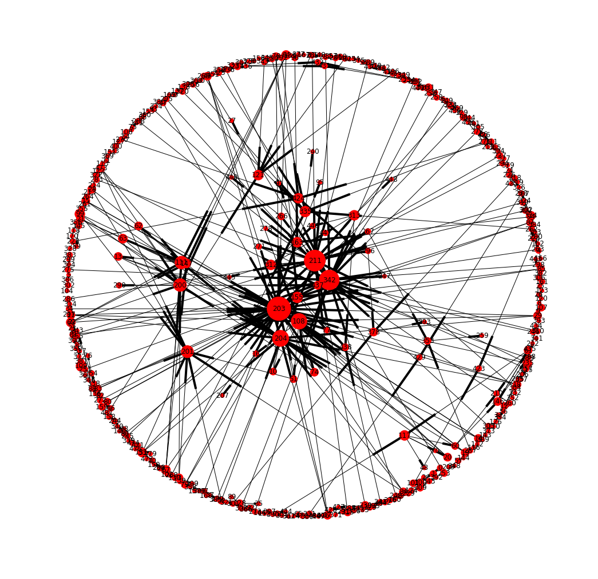
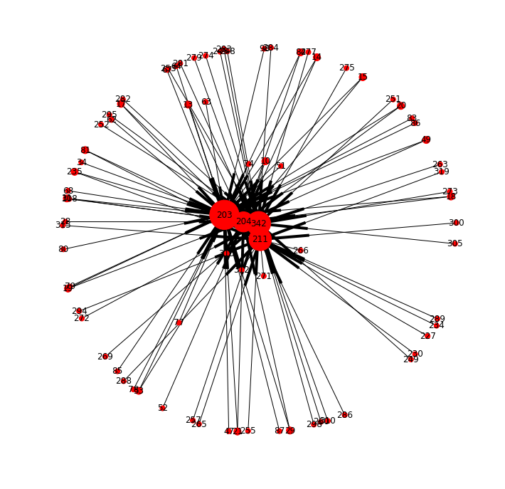
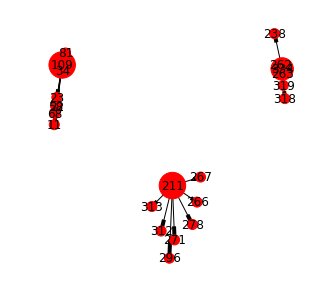

# [Curso *"De las redes complejas a las redes sociales: Introducción al Uso del Big Data"*][d6115b6a]

[d6115b6a]: http://desarrolloterritorial.ei.udelar.edu.uy/?p=2618 "webpage"

## Espacio Interdisciplinario


---

# Trabajo final

Para cargar la base de datos de grafos hay que copiar todos los archivos de la carpeta `graphdb` a la carpeta `/var/lib/neo4j/data/databases/graph.db/ `.

```bash
sudo cp -v /graphdb/* /var/lib/neo4j/data/databases/graph.db/

```

# Análisis de la red de *tweets* y usuarios relacionados con la final de la Liga Uruguaya de Basketball (LUB).


## Trabajo final del curso "De las redes complejas a las redes sociales: Introducción al Uso del Big Data"


### Integrantes del equipo: 

- Andrea Apolaro
- Guzmán López
- Leticia Vidal
- Ricardo Rezzano


## Introducción

En el marco del curso ...


## Metodología

Se utilizó el lenguaje de programación Python (versión 3.6.1) ...

### Importar librerías 


```python
# Import python libraries
import tweepy
import time
from random import choice
from py2neo import authenticate, Graph
import cypher
import networkx as nx
import matplotlib
import matplotlib.pyplot as plt
%matplotlib inline
```

### Autenticación de Twitter y Neo4j mediante la lectura de un archivo externo con las claves requeridas:


```python
import tweepy

# Twitter OAuthentication
consumer_key = "XXXXXXXXXX"
consumer_secret = "XXXXXXXXXX"
access_token = "XXXXXXXXXX"
access_token_secret = "XXXXXXXXXX"

auth = tweepy.OAuthHandler(consumer_key, consumer_secret)
auth.set_access_token(access_token, access_token_secret)

# Neo4j
neo4jUser = "xxxx"
neo4jPass = "xxxx"
```


```python
# Authentication credentials for Tweeter and Neo4j credentials
with open('/home/guzman/Documentos/Cursos/Redes Complejas - Introducción al uso del Big Data/Python/twitter-OAuth.py') as oauth:
    exec(oauth.read())
```

### Crear la API (Application Program Interface) de Twitter:


```python
# Create API
api = tweepy.API(auth, wait_on_rate_limit=True, wait_on_rate_limit_notify=True, compression=True)
```

### Comenzar el servicio de la base de datos Neo4j desde una consola:


```python
%%sh

# Start neo4j service 
systemctl start neo4j.service

# Check status of neo4j service
systemctl status neo4j.service
```

    ● neo4j.service - Neo4j
       Loaded: loaded (/usr/lib/systemd/system/neo4j.service; disabled; vendor preset: disabled)
       Active: active (running) since Wed 2017-06-07 13:22:51 -03; 4ms ago
      Process: 2687 ExecStart=/usr/bin/neo4j start (code=exited, status=0/SUCCESS)
     Main PID: 2747 (java)
        Tasks: 37 (limit: 4915)
       Memory: 22.2M
          CPU: 130ms
       CGroup: /system.slice/neo4j.service
               └─2747 /usr/sbin/java -cp /usr/share/java/neo4j/plugins:/etc/neo4j:/usr/share/java/neo4j/*:/usr/share/java/neo4j/plugins/* -server -XX:+UseG1GC -XX:-OmitStackTraceInFastThrow -XX:hashCode=5 -XX:+AlwaysPreTouch -XX:+UnlockExperimentalVMOptions -XX:+TrustFinalNonStaticFields -XX:+DisableExplicitGC -Djdk.tls.ephemeralDHKeySize=2048 -Dunsupported.dbms.udc.source=tarball -Dfile.encoding=UTF-8 org.neo4j.server.CommunityEntryPoint --home-dir=/usr/share/neo4j --config-dir=/etc/neo4j
    
    jun 07 13:22:51 carqueja systemd[1]: Starting Neo4j...
    jun 07 13:22:51 carqueja neo4j[2687]: Starting Neo4j.
    jun 07 13:22:51 carqueja neo4j[2687]: Started neo4j (pid 2747). By default, it is available at http://localhost:7474/
    jun 07 13:22:51 carqueja systemd[1]: Started Neo4j.


### Autenticación de la base de datos no relacional Neo4j a través de la lectura del archivo externo con las claves de usuario y contraseña requeridas leído anteriormente.


```python
# Neo4j DB graph authentication

# Connect to graph
url = "http://localhost:7474/db/data/"
authenticate("localhost:7474", neo4jUser, neo4jPass)
graph = Graph(url)

# Authentication for cypher package
connPar = "http://" + neo4jUser + ":" + neo4jPass + "@localhost:7474/db/data/"
```

### Agregar restricciones de unicidad a la base de datos:


```python
# Add uniqueness constraints
graph.run("CREATE CONSTRAINT ON (t:Tweet) ASSERT t.id IS UNIQUE;")
graph.run("CREATE CONSTRAINT ON (u:User) ASSERT u.screen_name IS UNIQUE;")
graph.run("CREATE CONSTRAINT ON (h:Hashtag) ASSERT h.name IS UNIQUE;")
graph.run("CREATE CONSTRAINT ON (l:Link) ASSERT l.url IS UNIQUE;")
graph.run("CREATE CONSTRAINT ON (s:Source) ASSERT s.name IS UNIQUE;")
```

### Construir una lista con las palabras clave para la búsqueda de tweets:


```python
# Query words
queries = ["aguada", "aguatero", "hebraica", "macabi", "finalesLUB", "juntosporlanovena", "vamossha", "finaleslub"]
```

### Crear un archivo de texto vacío para adjuntar (escribir) los nombres de los usuarios de los tweets encontrados:


```python
# Open file connection to append usernames
ufile = open("usernames_{}.txt".format("aguada-hebraica"), "a")
```

### Cargar script de comandos en Cypher como cadena de caracteres


```python
# Pass dict to Cypher and build query from cypher script file
with open('/home/guzman/Documentos/GitLab/ComplexNetworks/Cypher/queries-in-script.cypher') as query:
    query = query.read()

print(query)
```

    UNWIND {tweets} AS t
    
    WITH t
    ORDER BY t.id
    
    WITH t,
    t.entities AS e,
    t.user AS u,
    t.retweeted_status AS retweet
    
    MERGE (tweet:Tweet {id:t.id})
    SET tweet.text = t.text,
    tweet.created_at = t.created_at,
    tweet.favorites = t.favorite_count
    
    MERGE (user:User {screen_name:u.screen_name})
    SET user.name = u.name,
    user.location = u.location,
    user.followers = u.followers_count,
    user.following = u.friends_count,
    user.statuses = u.statuses_count,
    user.profile_image_url = u.profile_image_url
    
    MERGE (user)-[:POSTS]->(tweet)
    
    MERGE (source:Source {name:t.source})
    MERGE (tweet)-[:USING]->(source)
    
    FOREACH (h IN e.hashtags |
      MERGE (tag:Hashtag {name:LOWER(h.text)})
      MERGE (tag)-[:TAGS]->(tweet)
      )
    
      FOREACH (u IN e.urls |
        MERGE (url:Link {url:u.expanded_url})
        MERGE (tweet)-[:CONTAINS]->(url)
        )
    
        FOREACH (m IN e.user_mentions |
          MERGE (mentioned:User {screen_name:m.screen_name})
          ON CREATE SET mentioned.name = m.name
          MERGE (tweet)-[:MENTIONS]->(mentioned)
          )
    
          FOREACH (r IN [r IN [t.in_reply_to_status_id] WHERE r IS NOT NULL] |
            MERGE (reply_tweet:Tweet {id:r})
            MERGE (tweet)-[:REPLY_TO]->(reply_tweet)
            )
    
            FOREACH (retweet_id IN [x IN [retweet.id] WHERE x IS NOT NULL] |
              MERGE (retweet_tweet:Tweet {id:retweet_id})
              MERGE (tweet)-[:RETWEETS]->(retweet_tweet)
              )
    


### Definir los parámetros para la búsqueda de los tweets:


```python
# Parameters
count = 100 # The number of tweets to return per page, up to a maximum of 100. Defaults to 15.
result_type = "mixed" # Include both popular and real time results in the response.
until = "2017-06-04" # Returns tweets created before the given date.
lang = "es" # Restricts tweets to the given language
since_id = -1 # Returns results with an ID greater than (that is, more recent than) the specified ID.
```

### Definir una función para la búsqueda de tweets que contiene la función de búsqueda de tweets de la librería tweepy y recibe como parámetros las palabras clave de búsqueda y el ID.


```python
def search_tweets(query, since_id):
    return api.search(q=query, count=count, until=until, result_type=result_type, lang=lang, since_id=since_id)
```

### Iterar buscando tweets a partir de las palabras claves en la búsqueda y ejecutando el código importado en Cypher para insertar los registros en la base de datos no relacional de Neo4j. 


```python
while True:
    try:
        q = choice(queries)
        tweets = search_tweets(q, since_id)
        if tweets:
            plural = "s." if len(tweets) > 1 else "."
            print("Found " + str(len(tweets)) + " tweet" + plural)
        else:
            print("No tweets found.\n")
            time.sleep(65)
            continue
        
        since_id = tweets[0].id

        # Send Cypher query.
        graph.run(query, tweets=[tweet._json for tweet in tweets])

        # adding users to user list
        for tweet in tweets:
            ufile.write(tweet.user.screen_name+"\n")
        print("Tweets added to graph! \n")
        time.sleep(33)

    except Exception as e:
        print(e)
        time.sleep(33)
        continue
```

### Crear objeto de grafos a partir de consulta a la base de datos Neo4j y ver su información:


```python
# Query Neo4j
#results = cypher.run('MATCH usPostw=(:User)-[r:POSTS]->(:Tweet) \
#                      MATCH twRettw=(:Tweet)-[r2:RETWEETS]->(:Tweet) \
#                      MATCH twReptw=(:Tweet)-[r3:REPLY_TO]->(:Tweet) \
#                      MATCH twMenus=(:Tweet)-[r4:MENTIONS]->(:User) \
#                      RETURN usPostw,twRettw,twReptw,twMenus \
#                      LIMIT 100000;', conn=connPar)

results = cypher.run('MATCH (n:User)-[r]-(m:Tweet) \
                      RETURN n,r,m;', conn=connPar)

# Create graph object from Neo4j
g = results.get_graph()

# View info
print(nx.info(g))
```

    442 rows affected.
    Name: 
    Type: MultiDiGraph
    Number of nodes: 402
    Number of edges: 442
    Average in degree:   1.0995
    Average out degree:   1.0995


### Grafico simple del objeto de grafos:


```python
# Create network layout for visualizations
spring_pos = nx.spring_layout(g)

# Plot graph
matplotlib.rcParams['figure.figsize'] = (12, 12)

plt.axis("off")
nx.draw_networkx(g, pos = spring_pos, with_labels = False, node_size = 20)
```


### Gráfico del grafo donde el tamaño es directamente proporcional a la cantidad de conexiones de un nodo y así como también la escala de colores del azul al rojo:


```python
d = nx.degree(g)

# Plot graph
matplotlib.rcParams['figure.figsize'] = (18, 18)

plt.axis("off")
nx.draw_networkx(g, pos = spring_pos, with_labels = True, nodelist=d.keys(), node_size=[v * 50 for v in d.values()])
```





### Ver nodos:


```python
# View first five nodes
i = 0
for i in range(0,5):
    print(str(i + 1) + "- " + str(g.nodes(data=True)[i]))
    i = i + 1
```

    1- ('1', {'favorites': 0, 'created_at': 'Wed May 31 21:14:07 +0000 2017', 'id': 870025622801838080, 'text': 'RT @KarinaAguatera: tamos ahí @sandynyordi #JuntosPorLaNovena https://t.co/x2kWrWLrS2', 'labels': ['Tweet']})
    2- ('100', {'followers': 190, 'screen_name': 'KarinaAguatera', 'following': 964, 'name': '@JAKCARBONEROS', 'statuses': 1725, 'profile_image_url': 'http://pbs.twimg.com/profile_images/871221543908638720/x4FSyHJs_normal.jpg', 'location': 'montevideo', 'labels': ['User']})
    3- ('2', {'favorites': 1, 'created_at': 'Wed May 31 21:24:58 +0000 2017', 'id': 870028352631054336, 'text': 'mi trabajo de parto duro menos q sacar las entradas para la última final. #JuntosPorLaNovena', 'labels': ['Tweet']})
    4- ('0', {'favorites': 2, 'created_at': 'Wed May 31 21:03:11 +0000 2017', 'id': 870022870512152577, 'text': 'tamos ahí @sandynyordi #JuntosPorLaNovena https://t.co/x2kWrWLrS2', 'labels': ['Tweet']})
    5- ('101', {'followers': 24, 'screen_name': 'sandynyordi', 'following': 183, 'name': '° SANDY ☆', 'statuses': 193, 'profile_image_url': 'http://pbs.twimg.com/profile_images/869902165720039425/hxWQH2WE_normal.jpg', 'location': '', 'labels': ['User']})


### Ver ejes:


```python
# View first five edges
i = 0
for i in range(0,5):
    print(str(i + 1) + "- " + str(g.edges(data=True)[i]))
    i = i + 1
```

    1- ('1', '100', {'type': 'MENTIONS'})
    2- ('1', '101', {'type': 'MENTIONS'})
    3- ('100', '2', {'type': 'POSTS'})
    4- ('100', '0', {'type': 'POSTS'})
    5- ('0', '101', {'type': 'MENTIONS'})


```python
# Tipos de nodos (Usuarios y Tweets)

# Count User nodes
#resultsUserNodes = cypher.run('ALGO', conn=connPar)

# Consulta networkx
#fish2 = (n for n,d in G.nodes_iter(data=True) if d['label']=='fish')

#resultsUserNodes.dataframe

```

### Calcular principales métricas sobre el grafo total:


```python
# Tipo de grafo
esMultigrafo = g.is_multigraph()
esDireccional = g.is_directed()
esConectado = nx.is_connected(g.to_undirected())

# Número de nodos y conexiones
numNod = nx.number_of_nodes(g)
numEdg = nx.number_of_edges(g)

# Grados de un nodo (máximo, mínimo, promedio)
deg = nx.degree(g)
in_degrees  = g.in_degree()
out_degrees  = g.out_degree()

# Componentes conectados
if not esConectado:
    g2 = g.to_undirected() # saco direccionalidad

# Número de componentes conectados
numConComp = nx.number_connected_components(g2)

# Resumen
print("| -------------------------------------------- |")
if esMultigrafo:
    print("| Tipo de grafo: Multigrafo") 
if  not esMultigrafo: 
    print("| Tipo de grafo: Simple")

if esDireccional:
    print("| Direccional: Si") 
if  not esDireccional: 
    print("| Direccional: No")

if esConectado:
    print("| Conectado: Si") 
if  not esConectado: 
    print("| Conectado: No")
print("| -------------------------------------------- |")
print("| Número de nodos:", str(numNod))
print("| Número de conexiones:", str(numEdg))
print("| -------------------------------------------- |")
print("| Grado máximo entrada:", str(max(in_degrees.values())))
print("| Grado mínimo entrada:", str(min(in_degrees.values())))
print("| Grado promedio entrada:", str(sum(in_degrees.values())/len(deg.values())))
print("| -------------------------------------------- |")
print("| Grado máximo salida:", str(max(out_degrees.values())))
print("| Grado mínimo salida:", str(min(out_degrees.values())))
print("| Grado promedio salida:", str(sum(out_degrees.values())/len(deg.values())))
print("| -------------------------------------------- |")
print("| Grado máximo (no dir):", str(max(deg.values())))
print("| Grado mínimo (no dir):", str(min(deg.values())))
print("| Grado promedio (no dir):", str(sum(deg.values())/len(deg.values())))
print("| -------------------------------------------- |")
print("| Número total de componentes conectados: %d" % nx.number_connected_components(g2))
print("| -------------------------------------------- |")
```

    | -------------------------------------------- |
    | Tipo de grafo: Multigrafo
    | Direccional: Si
    | Conectado: No
    | -------------------------------------------- |
    | Número de nodos: 402
    | Número de conexiones: 442
    | -------------------------------------------- |
    | Grado máximo entrada: 34
    | Grado mínimo entrada: 0
    | Grado promedio entrada: 1.099502487562189
    | -------------------------------------------- |
    | Grado máximo salida: 7
    | Grado mínimo salida: 0
    | Grado promedio salida: 1.099502487562189
    | -------------------------------------------- |
    | Grado máximo (no dir): 34
    | Grado mínimo (no dir): 1
    | Grado promedio (no dir): 2.199004975124378
    | -------------------------------------------- |
    | Número total de componentes conectados: 45
    | -------------------------------------------- |


### Análisis sobre los componentes conectados, métricas en los subgrafos:


```python
# Subgrafos de componentes conectados
g2_conComp = list(nx.connected_component_subgraphs(g2))

# Definir función con las métricas adentro
def metricas_subgrafos(subgrafo):
    
    # crear diccionario vacío
    dict = {}
    
    # métricas
    numNodos = nx.number_of_nodes(subgrafo) # número de nodos
    numConex = nx.number_of_edges(subgrafo) # número de conexiones
    grados = nx.degree(subgrafo) # grados
    maxGrado = max(grados.values()) # grado max
    minGrado = min(grados.values()) # grado min
    promGrado = sum(grados.values())/len(grados.values())
    diametro = nx.diameter(subgrafo) # diámetro
    radio = nx.radius(subgrafo) # radio
    excentricidad = nx.eccentricity(subgrafo) # excentricidad
    centro = nx.center(subgrafo) # centro
    periferia = nx.periphery(subgrafo) # periferia
    densidad = nx.density(subgrafo) # densidad
    
    # agregar métricas al diccionario
    dict['nodos'] = numNodos
    dict['conexiones'] = numConex
    dict['grados'] = grados
    dict['maxgrado'] = maxGrado
    dict['mingrado'] = minGrado
    dict['promGrado'] = promGrado
    dict['diámetro'] = diametro
    dict['radio'] = radio
    dict['excentricidad'] = excentricidad
    dict['centro'] = centro
    dict['periferia'] = periferia
    dict['densidad'] = densidad
    
    # retorno
    return dict

# Aplicar función metricas_subgrafos a todos los subgrafos
listaMetSubg = []

for subg in g2_conComp:
    subgMet = metricas_subgrafos(subg)
    listaMetSubg.append(subgMet)

# Ver métricas y plot del primer subgrafo
import pandas as pd

myDict = listaMetSubg[14]
df = pd.DataFrame()
df['Parámetro'] = myDict.keys()
df['Valores'] = myDict.values()

print('++++++++++++++++++++++++++++++++++++++++++++++++++++++++++++++++++')
print(df)
print('++++++++++++++++++++++++++++++++++++++++++++++++++++++++++++++++++')

# Grados subgrafo
d = nx.degree(g2_conComp[14])

# Plot subgrafo
matplotlib.rcParams['figure.figsize'] = (5, 5)
plt.axis("off")
nx.draw_networkx(g2_conComp[14], pos = spring_pos, with_labels = True, nodelist=d.keys(), node_size=[v * 100 for v in d.values()])
```

    ++++++++++++++++++++++++++++++++++++++++++++++++++++++++++++++++++
            Parámetro                                          Valores
    0           nodos                                                5
    1      conexiones                                                4
    2          grados  {'35': 1, '128': 3, '164': 1, '92': 2, '89': 1}
    3        maxgrado                                                3
    4        mingrado                                                1
    5       promGrado                                              1.6
    6        diámetro                                                3
    7           radio                                                2
    8   excentricidad  {'35': 3, '128': 2, '164': 3, '92': 2, '89': 3}
    9          centro                                        [128, 92]
    10      periferia                                    [35, 164, 89]
    11       densidad                                              0.4
    ++++++++++++++++++++++++++++++++++++++++++++++++++++++++++++++++++


### Seleccionar el id, nombre y grado de los 10 nodos con más conexiones de salida:


```python
# Select most output connected nodes

resultsDegOut = cypher.run('MATCH (n:User)-[r]->(m:Tweet) \
                            RETURN id(n) AS ID, n.screen_name AS NOMBRE, count(*) AS GRADO \
                            ORDER BY GRADO DESC LIMIT 10', conn=connPar)

resultsDegOut.dataframe

```

    10 rows affected.


<div>
<style>
    .dataframe thead tr:only-child th {
        text-align: right;
    }

    .dataframe thead th {
        text-align: left;
    }

    .dataframe tbody tr th {
        vertical-align: top;
    }
</style>
<table border="1" class="dataframe">
  <thead>
    <tr style="text-align: right;">
      <th></th>
      <th>ID</th>
      <th>NOMBRE</th>
      <th>GRADO</th>
    </tr>
  </thead>
  <tbody>
    <tr>
      <th>0</th>
      <td>109</td>
      <td>CesarGroba2016</td>
      <td>7</td>
    </tr>
    <tr>
      <th>1</th>
      <td>211</td>
      <td>Hebraicaymacabi</td>
      <td>7</td>
    </tr>
    <tr>
      <th>2</th>
      <td>334</td>
      <td>AKolender</td>
      <td>5</td>
    </tr>
    <tr>
      <th>3</th>
      <td>117</td>
      <td>alcaide943</td>
      <td>4</td>
    </tr>
    <tr>
      <th>4</th>
      <td>131</td>
      <td>carlosRocha1891</td>
      <td>4</td>
    </tr>
    <tr>
      <th>5</th>
      <td>331</td>
      <td>MSTM1215</td>
      <td>4</td>
    </tr>
    <tr>
      <th>6</th>
      <td>108</td>
      <td>daianab81</td>
      <td>4</td>
    </tr>
    <tr>
      <th>7</th>
      <td>132</td>
      <td>Macucha23</td>
      <td>3</td>
    </tr>
    <tr>
      <th>8</th>
      <td>107</td>
      <td>EduuCabrera19</td>
      <td>3</td>
    </tr>
    <tr>
      <th>9</th>
      <td>159</td>
      <td>DanielaBrandon</td>
      <td>3</td>
    </tr>
  </tbody>
</table>
</div>


### Seleccionar el id, nombre y grado de los 10 nodos con más conexiones de entrada:


```python
resultsDegIn = cypher.run('MATCH (n:User)<-[r]-(m:Tweet) \
                           RETURN id(n) AS ID, n.screen_name AS NOMBRE, count(*) AS GRADO \
                           ORDER BY GRADO DESC LIMIT 10', conn=connPar)

resultsDegIn.dataframe

```

    10 rows affected.


<div>
<style>
    .dataframe thead tr:only-child th {
        text-align: right;
    }

    .dataframe thead th {
        text-align: left;
    }

    .dataframe tbody tr th {
        vertical-align: top;
    }
</style>
<table border="1" class="dataframe">
  <thead>
    <tr style="text-align: right;">
      <th></th>
      <th>ID</th>
      <th>NOMBRE</th>
      <th>GRADO</th>
    </tr>
  </thead>
  <tbody>
    <tr>
      <th>0</th>
      <td>203</td>
      <td>Aguada_oficial</td>
      <td>34</td>
    </tr>
    <tr>
      <th>1</th>
      <td>342</td>
      <td>LUB_Uy</td>
      <td>23</td>
    </tr>
    <tr>
      <th>2</th>
      <td>211</td>
      <td>Hebraicaymacabi</td>
      <td>20</td>
    </tr>
    <tr>
      <th>3</th>
      <td>204</td>
      <td>RinconAguatero</td>
      <td>16</td>
    </tr>
    <tr>
      <th>4</th>
      <td>108</td>
      <td>daianab81</td>
      <td>11</td>
    </tr>
    <tr>
      <th>5</th>
      <td>200</td>
      <td>PasionAguatera</td>
      <td>9</td>
    </tr>
    <tr>
      <th>6</th>
      <td>201</td>
      <td>HAguatera</td>
      <td>9</td>
    </tr>
    <tr>
      <th>7</th>
      <td>111</td>
      <td>Somos_Aguada</td>
      <td>8</td>
    </tr>
    <tr>
      <th>8</th>
      <td>424</td>
      <td>elmarcadortv</td>
      <td>6</td>
    </tr>
    <tr>
      <th>9</th>
      <td>335</td>
      <td>alenb259</td>
      <td>6</td>
    </tr>
  </tbody>
</table>
</div>


### Ver gráficos con los IDs con más conexiones de entrada:


```python
matplotlib.rcParams['figure.figsize'] = (12, 12)

resultsInDeg = cypher.run('MATCH a=(n:User)<-[r]-(m:Tweet) \
                           WHERE n.screen_name = "Aguada_oficial" \
                           OR n.screen_name = "LUB_Uy"\
                           OR n.screen_name = "Hebraicaymacabi" \
                           OR n.screen_name = "RinconAguatero" \
                           RETURN a;', conn=connPar)

# Create graph object from Neo4j
gInDeg = resultsInDeg.get_graph()

# View info
print(nx.info(gInDeg))

dInDeg = nx.degree(gInDeg)

# Plot graph
plt.axis("off")
nx.draw_networkx(gInDeg, pos = spring_pos, with_labels = True, nodelist=dInDeg.keys(), node_size=[v * 50 for v in dInDeg.values()])
```

    93 rows affected.
    Name: 
    Type: MultiDiGraph
    Number of nodes: 81
    Number of edges: 93
    Average in degree:   1.1481
    Average out degree:   1.1481





### Ver gráficos con los IDs con más conexiones de salida:


```python
resultsOutDeg = cypher.run('MATCH a=(n:User)-[r]->(m:Tweet) \
                            WHERE n.screen_name = "CesarGroba2016" \
                            OR n.screen_name = "Hebraicaymacabi"\
                            OR n.screen_name = "AKolender" \
                            RETURN a;', conn=connPar)

# Create graph object from Neo4j
gOutDeg = resultsOutDeg.get_graph()

# View info
print(nx.info(gOutDeg))

dOutDeg = nx.degree(gOutDeg)

# Plot graph
matplotlib.rcParams['figure.figsize'] = (5, 5)
plt.axis("off")
nx.draw_networkx(gOutDeg, pos = spring_pos, with_labels = True, nodelist=dOutDeg.keys(), node_size=[v * 100 for v in dOutDeg.values()])
```

    19 rows affected.
    Name: 
    Type: MultiDiGraph
    Number of nodes: 22
    Number of edges: 19
    Average in degree:   0.8636
    Average out degree:   0.8636


### Seleccionar el id, nombre y grado de los 10 nodos con más conexiones (entrada y salida):


```python
resultsDeg = cypher.run('MATCH (n:User)-[r]-(m:Tweet) \
                         RETURN id(n) AS ID, n.screen_name AS NOMBRE, count(*) AS GRADO \
                         ORDER BY GRADO DESC LIMIT 10', conn=connPar)

resultsDeg.dataframe

```

    10 rows affected.


<div>
<style>
    .dataframe thead tr:only-child th {
        text-align: right;
    }

    .dataframe thead th {
        text-align: left;
    }

    .dataframe tbody tr th {
        vertical-align: top;
    }
</style>
<table border="1" class="dataframe">
  <thead>
    <tr style="text-align: right;">
      <th></th>
      <th>ID</th>
      <th>NOMBRE</th>
      <th>GRADO</th>
    </tr>
  </thead>
  <tbody>
    <tr>
      <th>0</th>
      <td>203</td>
      <td>Aguada_oficial</td>
      <td>34</td>
    </tr>
    <tr>
      <th>1</th>
      <td>211</td>
      <td>Hebraicaymacabi</td>
      <td>27</td>
    </tr>
    <tr>
      <th>2</th>
      <td>342</td>
      <td>LUB_Uy</td>
      <td>24</td>
    </tr>
    <tr>
      <th>3</th>
      <td>204</td>
      <td>RinconAguatero</td>
      <td>16</td>
    </tr>
    <tr>
      <th>4</th>
      <td>108</td>
      <td>daianab81</td>
      <td>15</td>
    </tr>
    <tr>
      <th>5</th>
      <td>200</td>
      <td>PasionAguatera</td>
      <td>10</td>
    </tr>
    <tr>
      <th>6</th>
      <td>111</td>
      <td>Somos_Aguada</td>
      <td>10</td>
    </tr>
    <tr>
      <th>7</th>
      <td>201</td>
      <td>HAguatera</td>
      <td>9</td>
    </tr>
    <tr>
      <th>8</th>
      <td>155</td>
      <td>Castro_AnaLaura</td>
      <td>7</td>
    </tr>
    <tr>
      <th>9</th>
      <td>335</td>
      <td>alenb259</td>
      <td>7</td>
    </tr>
  </tbody>
</table>
</div>


### Ver gráficos con los IDs con más conexiones (entrada y salida):


```python
resultsInOutDeg = cypher.run('MATCH a=(n:User)-[r]-(m:Tweet) \
                              WHERE n.screen_name = "CesarGroba2016" \
                              OR n.screen_name = "Hebraicaymacabi"\
                              OR n.screen_name = "AKolender" \
                              RETURN a;', conn=connPar)

# Create graph object from Neo4j
gInOutDeg = resultsOutDeg.get_graph()

# View info
print(nx.info(gInOutDeg))

dInOutDeg = nx.degree(gInOutDeg)

# Plot graph
matplotlib.rcParams['figure.figsize'] = (6, 6)
plt.axis("off")
nx.draw_networkx(gInOutDeg, pos = spring_pos, with_labels = True, nodelist=dInOutDeg.keys(), node_size=[v * 100 for v in dInOutDeg.values()])
```

    39 rows affected.
    Name: 
    Type: MultiDiGraph
    Number of nodes: 22
    Number of edges: 19
    Average in degree:   0.8636
    Average out degree:   0.8636





### Seleccionar todas las palabras de los tweets de los dos nodos más conectados para construir una nube de palabras:


```python
# Nodo más conectado
resultsText1 = cypher.run('MATCH a=(n:User)-[r]-(m:Tweet) \
                          WHERE n.screen_name = "Aguada_oficial" \
                          RETURN DISTINCT(m.text);', conn=connPar)

# Open file connection to append resultsText
textAguadaOficial = open("AguadaOficialTweetText.txt", "a")
textAguadaOficial.write(str(resultsText1)+"/n")

# Segundo nodo más conectado
resultsText2 = cypher.run('MATCH a=(n:User)-[r]-(m:Tweet) \
                          WHERE n.screen_name = "Hebraicaymacabi" \
                          RETURN DISTINCT(m.text);', conn=connPar)

# Open file connection to append resultsText
textHebraicaymacabi = open("HebraicaymacabiTweetText.txt", "a")
textHebraicaymacabi.write(str(resultsText2)+"/n")

```

    16 rows affected.
    16 rows affected.


    3191


Ver nodo más conectado:


```python
resultsText1.dataframe
```


<div>
<style>
    .dataframe thead tr:only-child th {
        text-align: right;
    }

    .dataframe thead th {
        text-align: left;
    }

    .dataframe tbody tr th {
        vertical-align: top;
    }
</style>
<table border="1" class="dataframe">
  <thead>
    <tr style="text-align: right;">
      <th></th>
      <th>(m.text)</th>
    </tr>
  </thead>
  <tbody>
    <tr>
      <th>0</th>
      <td>RT @Mariog64: @Aguada_oficial @URUGUAYLATECAP ...</td>
    </tr>
    <tr>
      <th>1</th>
      <td>@cherrera88 @Aguada_oficial Eeeeeeeeee paaaara...</td>
    </tr>
    <tr>
      <th>2</th>
      <td>Es hoy #Juntosporlanovena 🙌🏼🙌🏼🙌🏼 @Aguada_ofici...</td>
    </tr>
    <tr>
      <th>3</th>
      <td>Y acá estamos! Vamos nosotros carajooo!!! #jun...</td>
    </tr>
    <tr>
      <th>4</th>
      <td>RT @Castro_AnaLaura: Es hoy #Juntosporlanovena...</td>
    </tr>
    <tr>
      <th>5</th>
      <td>40' para el salto inicial @Aguada_oficial vs @...</td>
    </tr>
    <tr>
      <th>6</th>
      <td>Es hoy @Aguada_oficial !!! Vamo arriba !! 💪🏽 \...</td>
    </tr>
    <tr>
      <th>7</th>
      <td>Es hoy @Aguada_oficial ! #JuntosPorLaNovena #a...</td>
    </tr>
    <tr>
      <th>8</th>
      <td>Es hoy!!! Trato de concentrarme en el trabajo ...</td>
    </tr>
    <tr>
      <th>9</th>
      <td>Ya no puedo mas... Tiene que ser hoy!!! #Junto...</td>
    </tr>
    <tr>
      <th>10</th>
      <td>RT @Colet12: Cuando tu amiga hace la fila xa e...</td>
    </tr>
    <tr>
      <th>11</th>
      <td>RT @Titotimothytim: Ya no puedo mas... Tiene q...</td>
    </tr>
    <tr>
      <th>12</th>
      <td>RT @daianab81: A Palacio y Estadio Propio llen...</td>
    </tr>
    <tr>
      <th>13</th>
      <td>ES HOY @Aguada_oficial 💚❤️\n#juntosporlanovena</td>
    </tr>
    <tr>
      <th>14</th>
      <td>Que mejor que empezar esta mañana de esta form...</td>
    </tr>
    <tr>
      <th>15</th>
      <td>A Palacio y Estadio Propio lleno!!! Así se viv...</td>
    </tr>
  </tbody>
</table>
</div>


Ver segundo nodo más conectado:


```python
resultsText2.dataframe
```


<div>
<style>
    .dataframe thead tr:only-child th {
        text-align: right;
    }

    .dataframe thead th {
        text-align: left;
    }

    .dataframe tbody tr th {
        vertical-align: top;
    }
</style>
<table border="1" class="dataframe">
  <thead>
    <tr style="text-align: right;">
      <th></th>
      <th>(m.text)</th>
    </tr>
  </thead>
  <tbody>
    <tr>
      <th>0</th>
      <td>RT @Hebraicaymacabi: La gloria: ¡MacaBI! ¡HACI...</td>
    </tr>
    <tr>
      <th>1</th>
      <td>RT @hundilacom: Crónica de la victoria de @Heb...</td>
    </tr>
    <tr>
      <th>2</th>
      <td>RT @Hebraicaymacabi: Sacamos 26! Abrazate! Hac...</td>
    </tr>
    <tr>
      <th>3</th>
      <td>RT @susanarosano1: @Hebraicaymacabi Felicitaci...</td>
    </tr>
    <tr>
      <th>4</th>
      <td>RT @Hebraicaymacabi: Final! Ganó Macabi 82 a 5...</td>
    </tr>
    <tr>
      <th>5</th>
      <td>RT @MarioNBarbato: @OPetinatti @Hebraicaymacab...</td>
    </tr>
    <tr>
      <th>6</th>
      <td>RT @abifitcoach: @OPetinatti @Hebraicaymacabi ...</td>
    </tr>
    <tr>
      <th>7</th>
      <td>RT @Mariog64: @Aguada_oficial @URUGUAYLATECAP ...</td>
    </tr>
    <tr>
      <th>8</th>
      <td>RT @dobleyfalta_uy: #LUB | las mejores imágene...</td>
    </tr>
    <tr>
      <th>9</th>
      <td>@Hebraicaymacabi MacaBI CAMPEÓN! Que huevo Heb...</td>
    </tr>
    <tr>
      <th>10</th>
      <td>RT @mago1377: @Hebraicaymacabi si señor un equ...</td>
    </tr>
    <tr>
      <th>11</th>
      <td>RT @Basketbol1010: los campeones Hebraica Maca...</td>
    </tr>
    <tr>
      <th>12</th>
      <td>La gloria: ¡MacaBI! ¡HACIENDO HISTORIA! https:...</td>
    </tr>
    <tr>
      <th>13</th>
      <td>RT @ElAguanteUy: Hebraica Macabi ganó la LUB y...</td>
    </tr>
    <tr>
      <th>14</th>
      <td>RT @LUB_Uy: Video Clip de la 7ma FINAL de LUB ...</td>
    </tr>
    <tr>
      <th>15</th>
      <td>40' para el salto inicial @Aguada_oficial vs @...</td>
    </tr>
  </tbody>
</table>
</div>


### Construir nube de palabras:


```python
from wordcloud import WordCloud, STOPWORDS
matplotlib.rcParams['figure.figsize'] = (15, 15)

#Convert all the required text into a single string here and store them in word_string
# you can specify fonts, stopwords, background color and other options

word_string1 = str(resultsText1)
word_string2 = str(resultsText2)

wordcloud1 = WordCloud(stopwords=STOPWORDS, max_font_size=50, background_color='white')
wordcloud1.generate(word_string1)

wordcloud2 = WordCloud(stopwords=STOPWORDS, max_font_size=50, background_color='white')
wordcloud2.generate(word_string2)
```

### Eliminar palabras no deseadas:


```python
noise_words_set = {'https', 'Aguada_oficial', 'Hebraicaymacabi'}

stuff = [' '.join(w for w in word_string1.split() if w.lower() not in noise_words_set)
         for word_string1 in word_string1]

print(stuff)
```

    ['+', '-', '-', '-', '-', '-', '-', '-', '-', '-', '-', '-', '-', '-', '-', '-', '-', '-', '-', '-', '-', '-', '-', '-', '-', '-', '-', '-', '-', '-', '-', '-', '-', '-', '-', '-', '-', '-', '-', '-', '-', '-', '-', '-', '-', '-', '-', '-', '-', '-', '-', '-', '-', '-', '-', '-', '-', '-', '-', '-', '-', '-', '-', '-', '-', '-', '-', '-', '-', '-', '-', '-', '-', '-', '-', '-', '-', '-', '-', '-', '-', '-', '-', '-', '-', '-', '-', '-', '-', '-', '-', '-', '-', '-', '-', '-', '-', '-', '-', '-', '-', '-', '-', '-', '-', '-', '-', '-', '-', '-', '-', '-', '-', '-', '-', '-', '-', '-', '-', '-', '-', '-', '-', '-', '-', '-', '-', '-', '-', '-', '-', '-', '-', '-', '-', '-', '-', '-', '-', '-', '-', '-', '-', '+', '', '|', '', '', '', '', '', '', '', '', '', '', '', '', '', '', '', '', '', '', '', '', '', '', '', '', '', '', '', '', '', '', '', '', '', '', '', '', '', '', '', '', '', '', '', '', '', '', '', '', '', '', '', '', '', '', '', '', '', '', '', '', '', '', '', '', '', '', '', '(', 'm', '.', 't', 'e', 'x', 't', ')', '', '', '', '', '', '', '', '', '', '', '', '', '', '', '', '', '', '', '', '', '', '', '', '', '', '', '', '', '', '', '', '', '', '', '', '', '', '', '', '', '', '', '', '', '', '', '', '', '', '', '', '', '', '', '', '', '', '', '', '', '', '', '', '', '', '', '', '|', '', '+', '-', '-', '-', '-', '-', '-', '-', '-', '-', '-', '-', '-', '-', '-', '-', '-', '-', '-', '-', '-', '-', '-', '-', '-', '-', '-', '-', '-', '-', '-', '-', '-', '-', '-', '-', '-', '-', '-', '-', '-', '-', '-', '-', '-', '-', '-', '-', '-', '-', '-', '-', '-', '-', '-', '-', '-', '-', '-', '-', '-', '-', '-', '-', '-', '-', '-', '-', '-', '-', '-', '-', '-', '-', '-', '-', '-', '-', '-', '-', '-', '-', '-', '-', '-', '-', '-', '-', '-', '-', '-', '-', '-', '-', '-', '-', '-', '-', '-', '-', '-', '-', '-', '-', '-', '-', '-', '-', '-', '-', '-', '-', '-', '-', '-', '-', '-', '-', '-', '-', '-', '-', '-', '-', '-', '-', '-', '-', '-', '-', '-', '-', '-', '-', '-', '-', '-', '-', '-', '-', '-', '-', '-', '+', '', '|', '', 'R', 'T', '', '@', 'M', 'a', 'r', 'i', 'o', 'g', '6', '4', ':', '', '@', 'A', 'g', 'u', 'a', 'd', 'a', '_', 'o', 'f', 'i', 'c', 'i', 'a', 'l', '', '@', 'U', 'R', 'U', 'G', 'U', 'A', 'Y', 'L', 'A', 'T', 'E', 'C', 'A', 'P', '', '@', 'H', 'e', 'b', 'r', 'a', 'i', 'c', 'a', 'y', 'm', 'a', 'c', 'a', 'b', 'i', '', 'S', 'a', 'l', 'u', 'd', '', 'M', 'a', 'c', 'a', 'b', 'i', '', 'y', '', 'u', 'n', '', '👏', '👏', '', 'g', 'r', 'a', 'n', 'd', 'e', '', 'p', 'a', 'r', 'a', '', 'A', 'g', 'u', 'a', 'd', 'a', '', ',', '', 'd', 'e', '', 'u', 'n', '', 'g', 'o', 'e', 'n', 's', 'e', '', 'd', 'e', '', 'l', 'e', 'y', '', '!', '!', '', 'M', 'u', 'y', '', 'b', 'u', 'e', 'n', 'a', '', 's', '…', '', '|', '', '|', '', '', '', '', '', '', '', '', '', '', '', '', '', '', '', '', '', '@', 'c', 'h', 'e', 'r', 'r', 'e', 'r', 'a', '8', '8', '', '@', 'A', 'g', 'u', 'a', 'd', 'a', '_', 'o', 'f', 'i', 'c', 'i', 'a', 'l', '', 'E', 'e', 'e', 'e', 'e', 'e', 'e', 'e', 'e', 'e', '', 'p', 'a', 'a', 'a', 'a', 'r', 'a', '', 'u', 'n', '', 'p', 'o', 'c', 'o', '', 'g', 'u', 'a', 'c', 'h', 'i', 'n', 'n', 'n', 'n', '', '#', 'j', 'u', 'n', 't', 'o', 's', 'p', 'o', 'r', 'l', 'a', 'n', 'o', 'v', 'e', 'n', 'a', '', '😂', '😂', '😂', '😂', '😂', '😂', '😂', '😂', '😂', '😂', '😂', '😂', '😂', '😂', '😂', '😂', '😂', '😂', '😂', '😂', '😂', '😂', '', '', '', '', '', '', '', '', '', '', '', '', '', '', '', '', '', '', '|', '', '|', '', '', '', '', '', '', '', '', '', '', '', '', '', '', '', '', '', '', '', '', '', '', '', '', '', '', '', '', '', '', '', '', '', '', '', '', '', '', '', 'E', 's', '', 'h', 'o', 'y', '', '#', 'J', 'u', 'n', 't', 'o', 's', 'p', 'o', 'r', 'l', 'a', 'n', 'o', 'v', 'e', 'n', 'a', '', '🙌', '🏼', '🙌', '🏼', '🙌', '🏼', '', '@', 'A', 'g', 'u', 'a', 'd', 'a', '_', 'o', 'f', 'i', 'c', 'i', 'a', 'l', '', '💚', '❤', '️', '💚', '❤', '️', '💚', '❤', '️', '🏀', '🏀', '🏀', '🏀', '🏀', '', '', '', '', '', '', '', '', '', '', '', '', '', '', '', '', '', '', '', '', '', '', '', '', '', '', '', '', '', '', '', '', '', '', '', '', '', '', '', '', '|', '', '|', '', '', '', '', '', 'Y', '', 'a', 'c', 'á', '', 'e', 's', 't', 'a', 'm', 'o', 's', '!', '', 'V', 'a', 'm', 'o', 's', '', 'n', 'o', 's', 'o', 't', 'r', 'o', 's', '', 'c', 'a', 'r', 'a', 'j', 'o', 'o', 'o', '!', '!', '!', '', '#', 'j', 'u', 'n', 't', 'o', 's', 'p', 'o', 'r', 'l', 'a', 'n', 'o', 'v', 'e', 'n', 'a', '', '@', 'A', 'g', 'u', 'a', 'd', 'a', '_', 'o', 'f', 'i', 'c', 'i', 'a', 'l', '', '@', 'P', 'a', 's', 'i', 'o', 'n', 'A', 'g', 'u', 'a', 't', 'e', 'r', 'a', '', '@', 'S', 'o', 'm', 'o', 's', '_', 'A', 'g', 'u', 'a', 'd', 'a', '…', '', 'h', 't', 't', 'p', 's', ':', '/', '/', 't', '.', 'c', 'o', '/', 'C', 'n', 'P', 'x', 'b', 'u', 'p', '7', 'c', 'F', '', '', '', '', '', '', '|', '', '|', '', '', '', '', '', '', '', '', '', '', '', '', '', '', '', '', '', '', '', '', '', '', '', '', '', '', '', '', '', 'R', 'T', '', '@', 'C', 'a', 's', 't', 'r', 'o', '_', 'A', 'n', 'a', 'L', 'a', 'u', 'r', 'a', ':', '', 'E', 's', '', 'h', 'o', 'y', '', '#', 'J', 'u', 'n', 't', 'o', 's', 'p', 'o', 'r', 'l', 'a', 'n', 'o', 'v', 'e', 'n', 'a', '', '🙌', '🏼', '🙌', '🏼', '🙌', '🏼', '', '@', 'A', 'g', 'u', 'a', 'd', 'a', '_', 'o', 'f', 'i', 'c', 'i', 'a', 'l', '', '💚', '❤', '️', '💚', '❤', '️', '💚', '❤', '️', '🏀', '🏀', '🏀', '🏀', '🏀', '', '', '', '', '', '', '', '', '', '', '', '', '', '', '', '', '', '', '', '', '', '', '', '', '', '', '', '', '', '|', '', '|', '', '', '', '', '', '', '', '', '', '', '', '', '', '', '', '', '', '4', '0', "'", '', 'p', 'a', 'r', 'a', '', 'e', 'l', '', 's', 'a', 'l', 't', 'o', '', 'i', 'n', 'i', 'c', 'i', 'a', 'l', '', '@', 'A', 'g', 'u', 'a', 'd', 'a', '_', 'o', 'f', 'i', 'c', 'i', 'a', 'l', '', 'v', 's', '', '@', 'H', 'e', 'b', 'r', 'a', 'i', 'c', 'a', 'y', 'm', 'a', 'c', 'a', 'b', 'i', '', '#', 'L', 'U', 'B', '', '7', 'a', '', 'F', 'I', 'N', 'A', 'L', '', '#', 'V', 'A', 'M', 'O', 'S', 'A', 'G', 'U', 'A', 'D', 'A', '', '#', 'j', 'u', 'n', 't', 'o', 's', 'p', 'o', 'r', 'l', 'a', 'n', 'o', 'v', 'e', 'n', 'a', '', '', '', '', '', '', '', '', '', '', '', '', '', '', '', '', '', '', '|', '', '|', '', '', '', '', '', '', '', '', '', '', '', '', '', '', '', '', '', '', '', '', '', '', '', '', '', '', '', '', '', '', '', '', '', '', '', '', '', '', '', '', '', '', '', '', '', '', '', '', 'E', 's', '', 'h', 'o', 'y', '', '@', 'A', 'g', 'u', 'a', 'd', 'a', '_', 'o', 'f', 'i', 'c', 'i', 'a', 'l', '', '!', '!', '!', '', 'V', 'a', 'm', 'o', '', 'a', 'r', 'r', 'i', 'b', 'a', '', '!', '!', '', '💪', '🏽', '', '', '', '', '', '', '', '', '', '', '', '', '', '', '', '', '', '', '', '', '', '', '', '', '', '', '', '', '', '', '', '', '', '', '', '', '', '', '', '', '', '', '', '', '', '', '', '', '', '', '|', '', '|', '', '', '', '', '', '', '', '', '', '', '', '', '', '', '', '', '', '', '', '', '', '', '', '', '', '', '', '', '', '', '', '', '', '', '', '', '', '', '', '', '', '', '', '', '', '', '', '', '', '', '', '', '', '', '', '', '', '', '', '', '', '', '#', 'J', 'u', 'n', 't', 'o', 's', 'p', 'o', 'r', 'l', 'a', 'n', 'o', 'v', 'e', 'n', 'a', '', '', '', '', '', '', '', '', '', '', '', '', '', '', '', '', '', '', '', '', '', '', '', '', '', '', '', '', '', '', '', '', '', '', '', '', '', '', '', '', '', '', '', '', '', '', '', '', '', '', '', '', '', '', '', '', '', '', '', '', '', '', '|', '', '|', '', '', '', '', '', '', '', '', '', '', '', '', '', '', '', '', '', '', '', '', 'E', 's', '', 'h', 'o', 'y', '', '@', 'A', 'g', 'u', 'a', 'd', 'a', '_', 'o', 'f', 'i', 'c', 'i', 'a', 'l', '', '!', '', '#', 'J', 'u', 'n', 't', 'o', 's', 'P', 'o', 'r', 'L', 'a', 'N', 'o', 'v', 'e', 'n', 'a', '', '#', 'a', 'g', 'u', 'a', 'd', 'a', '', '@', 'R', 'i', 'n', 'c', 'o', 'n', 'A', 'g', 'u', 'a', 't', 'e', 'r', 'o', '', '@', 'H', 'A', 'g', 'u', 'a', 't', 'e', 'r', 'a', '', 'h', 't', 't', 'p', 's', ':', '/', '/', 't', '.', 'c', 'o', '/', 'e', 'c', 'G', 'C', 'O', 'M', 't', 'y', 'E', '5', '', '', '', '', '', '', '', '', '', '', '', '', '', '', '', '', '', '', '', '', '|', '', '|', '', '', '', 'E', 's', '', 'h', 'o', 'y', '!', '!', '!', '', 'T', 'r', 'a', 't', 'o', '', 'd', 'e', '', 'c', 'o', 'n', 'c', 'e', 'n', 't', 'r', 'a', 'r', 'm', 'e', '', 'e', 'n', '', 'e', 'l', '', 't', 'r', 'a', 'b', 'a', 'j', 'o', '', 'y', '', 'l', 'a', '', 'c', 'a', 'b', 'e', 'z', 'a', '', 's', 'e', '', 'm', 'e', '', 'd', 'i', 's', 'p', 'a', 'r', 'a', '', 'a', '', 'c', 'a', 'd', 'a', '', 's', 'e', 'g', 'u', 'n', 'd', 'o', '!', '!', '', '😱', '', '#', 'j', 'u', 'n', 't', 'o', 's', 'p', 'o', 'r', 'l', 'a', 'n', 'o', 'v', 'e', 'n', 'a', '', '@', 'A', 'g', 'u', 'a', 'd', 'a', '_', 'o', 'f', 'i', 'c', 'i', 'a', 'l', '', '@', 'H', 'A', 'g', 'u', 'a', 't', 'e', 'r', 'a', '', '', '', '|', '', '|', '', '', '', '', '', '', '', 'Y', 'a', '', 'n', 'o', '', 'p', 'u', 'e', 'd', 'o', '', 'm', 'a', 's', '.', '.', '.', '', 'T', 'i', 'e', 'n', 'e', '', 'q', 'u', 'e', '', 's', 'e', 'r', '', 'h', 'o', 'y', '!', '!', '!', '', '#', 'J', 'u', 'n', 't', 'o', 's', 'P', 'o', 'r', 'L', 'a', 'N', 'o', 'v', 'e', 'n', 'a', '', '@', 'A', 'g', 'u', 'a', 'd', 'a', '_', 'o', 'f', 'i', 'c', 'i', 'a', 'l', '', '@', 'S', 'o', 'm', 'o', 's', '_', 'A', 'g', 'u', 'a', 'd', 'a', '', '@', 'P', 'a', 's', 'i', 'o', 'n', 'A', 'g', 'u', 'a', 't', 'e', 'r', 'a', '', 'h', 't', 't', 'p', 's', ':', '/', '/', 't', '.', 'c', 'o', '/', 'J', 'L', '5', 'i', 'W', 'L', 'H', '0', 'd', '9', '', '', '', '', '', '', '', '|', '', '|', '', 'R', 'T', '', '@', 'C', 'o', 'l', 'e', 't', '1', '2', ':', '', 'C', 'u', 'a', 'n', 'd', 'o', '', 't', 'u', '', 'a', 'm', 'i', 'g', 'a', '', 'h', 'a', 'c', 'e', '', 'l', 'a', '', 'f', 'i', 'l', 'a', '', 'x', 'a', '', 'e', 'l', '', 'p', 'a', 'r', 't', 'i', 'd', 'o', '', '1', '0', 'h', 's', '', 'a', 'n', 't', 'e', 's', '!', '', '❤', '️', '💚', '#', 'J', 'u', 'n', 't', 'o', 's', 'P', 'o', 'r', 'L', 'a', 'N', 'o', 'v', 'e', 'n', 'a', '', '@', 'R', 'i', 'n', 'c', 'o', 'n', 'A', 'g', 'u', 'a', 't', 'e', 'r', 'o', '', '@', 'H', 'A', 'g', 'u', 'a', 't', 'e', 'r', 'a', '', '@', 'A', 'g', 'u', 'a', 'd', 'a', '_', 'o', 'f', 'i', 'c', 'i', 'a', 'l', '', '@', 'S', 'o', 'm', 'o', 's', '…', '', '|', '', '|', '', 'R', 'T', '', '@', 'T', 'i', 't', 'o', 't', 'i', 'm', 'o', 't', 'h', 'y', 't', 'i', 'm', ':', '', 'Y', 'a', '', 'n', 'o', '', 'p', 'u', 'e', 'd', 'o', '', 'm', 'a', 's', '.', '.', '.', '', 'T', 'i', 'e', 'n', 'e', '', 'q', 'u', 'e', '', 's', 'e', 'r', '', 'h', 'o', 'y', '!', '!', '!', '', '#', 'J', 'u', 'n', 't', 'o', 's', 'P', 'o', 'r', 'L', 'a', 'N', 'o', 'v', 'e', 'n', 'a', '', '@', 'A', 'g', 'u', 'a', 'd', 'a', '_', 'o', 'f', 'i', 'c', 'i', 'a', 'l', '', '@', 'S', 'o', 'm', 'o', 's', '_', 'A', 'g', 'u', 'a', 'd', 'a', '', '@', 'P', 'a', 's', 'i', 'o', 'n', 'A', 'g', 'u', 'a', 't', 'e', 'r', 'a', '', 'h', 't', 't', 'p', 's', ':', '/', '/', 't', '.', 'c', 'o', '/', 'J', '…', '', '|', '', '|', '', 'R', 'T', '', '@', 'd', 'a', 'i', 'a', 'n', 'a', 'b', '8', '1', ':', '', 'A', '', 'P', 'a', 'l', 'a', 'c', 'i', 'o', '', 'y', '', 'E', 's', 't', 'a', 'd', 'i', 'o', '', 'P', 'r', 'o', 'p', 'i', 'o', '', 'l', 'l', 'e', 'n', 'o', '!', '!', '!', '', 'A', 's', 'í', '', 's', 'e', '', 'v', 'i', 'v', 'e', '', 'l', 'a', '', 'f', 'i', 'n', 'a', 'l', '', 'e', 'n', '', '@', 'A', 'g', 'u', 'a', 'd', 'a', '_', 'o', 'f', 'i', 'c', 'i', 'a', 'l', '', '#', 'j', 'u', 'n', 't', 'o', 's', 'p', 'o', 'r', 'l', 'a', 'n', 'o', 'v', 'e', 'n', 'a', '', '❤', '️', '💚', '@', 'R', 'i', 'n', 'c', 'o', 'n', 'A', 'g', 'u', 'a', 't', 'e', 'r', 'o', '', '@', 'S', 'o', 'm', 'o', 's', '_', 'A', 'g', 'u', '…', '', '|', '', '|', '', '', '', '', '', '', '', '', '', '', '', '', '', '', '', '', '', '', '', '', '', '', '', '', '', '', '', '', '', '', '', '', '', '', '', '', '', '', '', '', '', '', '', '', '', '', '', '', '', '', '', '', '', '', '', '', '', '', 'E', 'S', '', 'H', 'O', 'Y', '', '@', 'A', 'g', 'u', 'a', 'd', 'a', '_', 'o', 'f', 'i', 'c', 'i', 'a', 'l', '', '💚', '❤', '️', '', '', '', '', '', '', '', '', '', '', '', '', '', '', '', '', '', '', '', '', '', '', '', '', '', '', '', '', '', '', '', '', '', '', '', '', '', '', '', '', '', '', '', '', '', '', '', '', '', '', '', '', '', '', '', '', '', '', '|', '', '|', '', '', '', '', '', '', '', '', '', '', '', '', '', '', '', '', '', '', '', '', '', '', '', '', '', '', '', '', '', '', '', '', '', '', '', '', '', '', '', '', '', '', '', '', '', '', '', '', '', '', '', '', '', '', '', '', '', '', '', '', '', '', '#', 'j', 'u', 'n', 't', 'o', 's', 'p', 'o', 'r', 'l', 'a', 'n', 'o', 'v', 'e', 'n', 'a', '', '', '', '', '', '', '', '', '', '', '', '', '', '', '', '', '', '', '', '', '', '', '', '', '', '', '', '', '', '', '', '', '', '', '', '', '', '', '', '', '', '', '', '', '', '', '', '', '', '', '', '', '', '', '', '', '', '', '', '', '', '', '|', '', '|', '', '', '', '', '', '', '', '', '', '', 'Q', 'u', 'e', '', 'm', 'e', 'j', 'o', 'r', '', 'q', 'u', 'e', '', 'e', 'm', 'p', 'e', 'z', 'a', 'r', '', 'e', 's', 't', 'a', '', 'm', 'a', 'ñ', 'a', 'n', 'a', '', 'd', 'e', '', 'e', 's', 't', 'a', '', 'f', 'o', 'r', 'm', 'a', '.', '', '#', 'j', 'u', 'n', 't', 'o', 's', 'p', 'o', 'r', 'l', 'a', 'n', 'o', 'v', 'e', 'n', 'a', '', 'E', 's', '', 'h', 'o', 'y', '', 'q', 'u', 'e', 'r', 'i', 'd', 'o', '', '@', 'A', 'g', 'u', 'a', 'd', 'a', '_', 'o', 'f', 'i', 'c', 'i', 'a', 'l', '', 'h', 't', 't', 'p', 's', ':', '/', '/', 't', '.', 'c', 'o', '/', 'o', 'f', 's', 'p', 'H', 'f', 'Z', 'I', 'L', 'j', '', '', '', '', '', '', '', '', '', '', '|', '', '|', '', '', 'A', '', 'P', 'a', 'l', 'a', 'c', 'i', 'o', '', 'y', '', 'E', 's', 't', 'a', 'd', 'i', 'o', '', 'P', 'r', 'o', 'p', 'i', 'o', '', 'l', 'l', 'e', 'n', 'o', '!', '!', '!', '', 'A', 's', 'í', '', 's', 'e', '', 'v', 'i', 'v', 'e', '', 'l', 'a', '', 'f', 'i', 'n', 'a', 'l', '', 'e', 'n', '', '@', 'A', 'g', 'u', 'a', 'd', 'a', '_', 'o', 'f', 'i', 'c', 'i', 'a', 'l', '', '#', 'j', 'u', 'n', 't', 'o', 's', 'p', 'o', 'r', 'l', 'a', 'n', 'o', 'v', 'e', 'n', 'a', '', '❤', '️', '💚', '@', 'R', 'i', 'n', 'c', 'o', 'n', 'A', 'g', 'u', 'a', 't', 'e', 'r', 'o', '…', '', 'h', 't', 't', 'p', 's', ':', '/', '/', 't', '.', 'c', 'o', '/', 'M', 'p', 'G', 'a', 's', '5', 'h', 'Z', 'U', '7', '', '', '|', '', '+', '-', '-', '-', '-', '-', '-', '-', '-', '-', '-', '-', '-', '-', '-', '-', '-', '-', '-', '-', '-', '-', '-', '-', '-', '-', '-', '-', '-', '-', '-', '-', '-', '-', '-', '-', '-', '-', '-', '-', '-', '-', '-', '-', '-', '-', '-', '-', '-', '-', '-', '-', '-', '-', '-', '-', '-', '-', '-', '-', '-', '-', '-', '-', '-', '-', '-', '-', '-', '-', '-', '-', '-', '-', '-', '-', '-', '-', '-', '-', '-', '-', '-', '-', '-', '-', '-', '-', '-', '-', '-', '-', '-', '-', '-', '-', '-', '-', '-', '-', '-', '-', '-', '-', '-', '-', '-', '-', '-', '-', '-', '-', '-', '-', '-', '-', '-', '-', '-', '-', '-', '-', '-', '-', '-', '-', '-', '-', '-', '-', '-', '-', '-', '-', '-', '-', '-', '-', '-', '-', '-', '-', '-', '+']


### Nube de palabras:


```python
plt.imshow(wordcloud1)
plt.axis('off')
plt.show()

plt.imshow(wordcloud2)
plt.axis('off')
plt.show()
```


